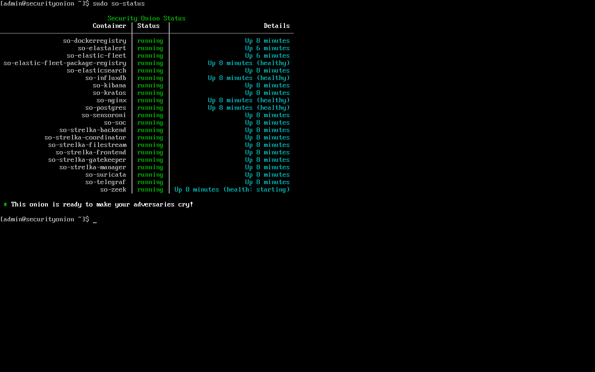
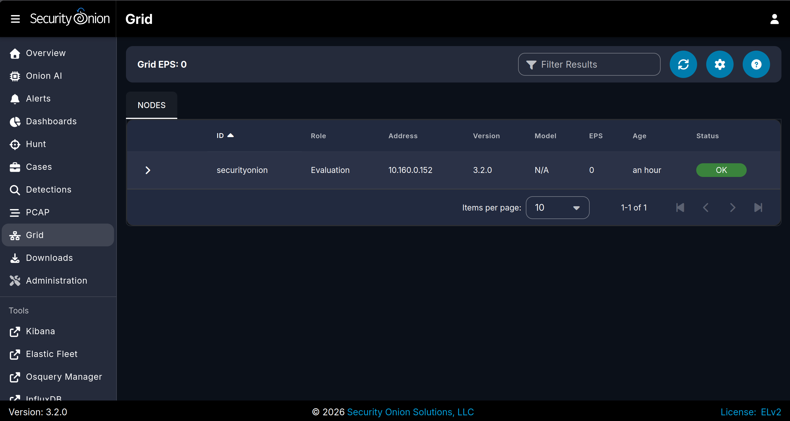
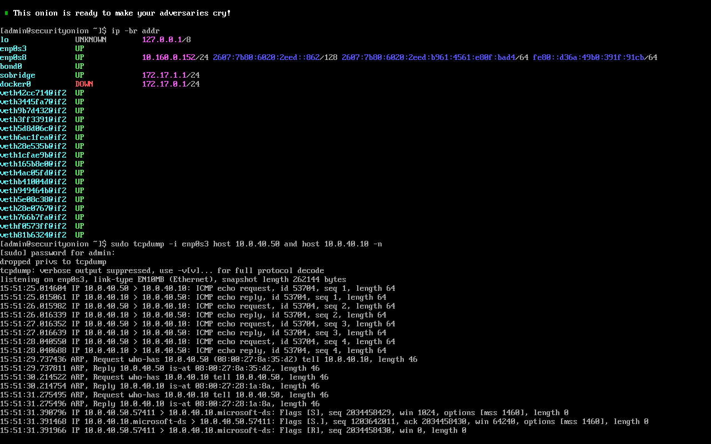
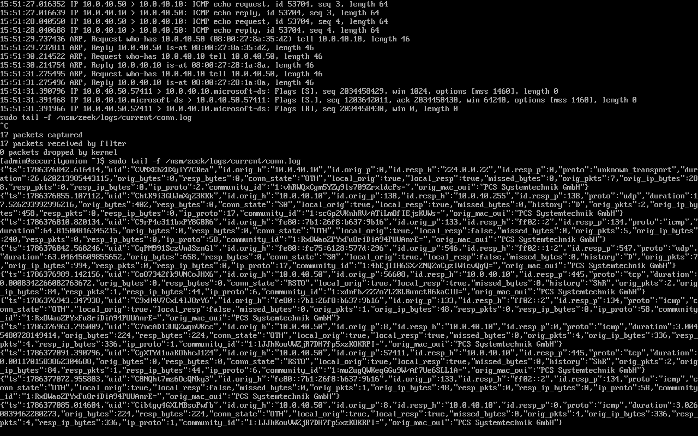

# Network Sensor Lab — Security Onion 3.2.0

A home lab network security monitoring build. I deployed Security Onion (Zeek + Suricata) as a sensor on an existing Active Directory lab network, ran a set of attacks against the domain, and documented what the **network** sees versus what the **host** telemetry saw in my earlier [AD Security Lab](https://github.com/suepercrab/ActiveDirectory-Security-Lab) and [Wazuh SOC Lab](https://github.com/suepercrab/wazuh-soc-lab). I also authored and tested my own Suricata detection rule.

The point of this lab is the comparison. Some attacks are loud on the wire and nearly invisible to host logs; others are the reverse. That gap is why a real SOC runs both types of sensors.

## Environment

| Host | Role | IP |
|------|------|----|
| securityonion | Sensor: Zeek + Suricata + SOC console | mgmt DHCP (bridged); monitor: no IP |
| DC01 | Domain controller / target | 10.0.40.10 |
| WIN11 | Domain client / target | 10.0.40.20 |
| Kali | Attacker | 10.0.40.50 |

- Platform: VirtualBox on Linux Mint host, 32 GB RAM. Domain: `corp.lab`, subnet `10.0.40.0/24`.
- Install type: **Eval** (single node, live sniffing). Version **3.2.0**.
- Monitor NIC: `enp0s3` (no IP, promiscuous, sniffs labnet). Management NIC: `enp0s8` (`10.160.0.152`, bridged). Suricata/Zeek read the bonded interface `bond0`.

## Visibility proof (before trusting any result)

A sensor can look perfectly healthy while seeing nothing, so I proved the monitor interface actually receives other hosts' traffic before recording anything. `tcpdump` on the monitor NIC shows Kali↔DC01 traffic even though the sensor is neither host, that is the software equivalent of a SPAN/mirror port working.

## Detections

| # | Attack | ATT&CK | Doc |
|---|--------|--------|-----|
| 01 | Port scan | T1046 Network Service Discovery | [detections/01-port-scan.md](detections/01-port-scan.md) |
| 02 | Password spray | T1110.003 Password Spraying | [detections/02-password-spray.md](detections/02-password-spray.md) |
| 03 | Payload retrieval | T1105 Ingress Tool Transfer | [detections/03-payload-retrieval.md](detections/03-payload-retrieval.md) |
| 04 | Custom Suricata rules | T1046 | [detections/04-custom-suricata-rules.md](detections/04-custom-suricata-rules.md) |

Build notes and the troubleshooting I hit (Zeek JSON logs, log rotation, memory pressure, why some detections only showed in the web UI): [docs/troubleshooting-and-lessons.md](docs/troubleshooting-and-lessons.md).

## Host vs. network — the thesis

| Attack | Network (this lab) | Host (AD / Wazuh labs) | Which wins |
|--------|--------------------|------------------------|------------|
| Port scan | Strong: `conn.log` REJ fan out (one src → many ports) + Suricata ET SCAN alerts | Weak: barely touches Windows event logs | **Network** |
| Password spray | Strong pattern: `ntlm.log` shows one source sweeping many usernames + Suricata NTLM alerts | Strong attribution: 4625 failures / 4624 success name the account that fell | **Both** (network shows the pattern, host names the victim) |
| Payload retrieval | Strong: Suricata reconstructed the HTTP GET and filename off the wire; fired 3 ET HUNTING signatures | None: endpoint never touched | **Network** |

**Best single story:** the nmap blind spot I documented in the AD lab — where a port scan barely registered in host logs — is closed here by the network sensor.

## Status

- [x] Sensor deployed, visibility proven
- [x] Port scan — captured (network + host comparison)
- [x] Password spray — captured (network + host comparison)
- [x] Payload retrieval — captured (Suricata, with a documented Zeek file-carving gap)
- [x] Custom SYN-scan rule (sid 1000001) — authored, fired, validated
