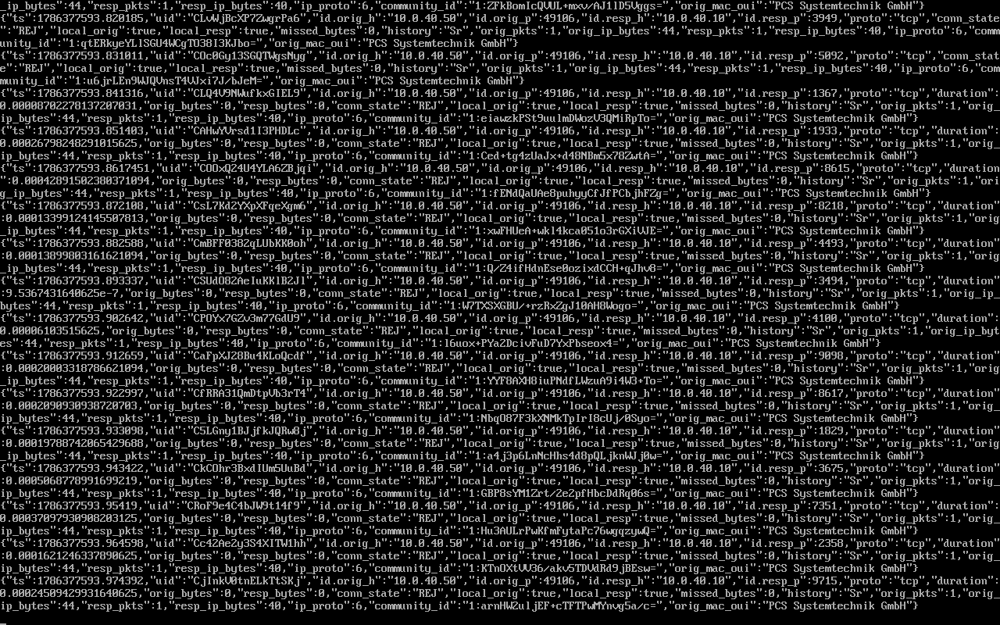
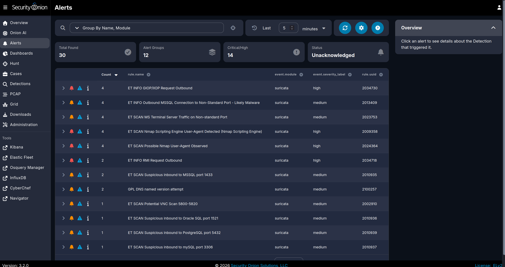
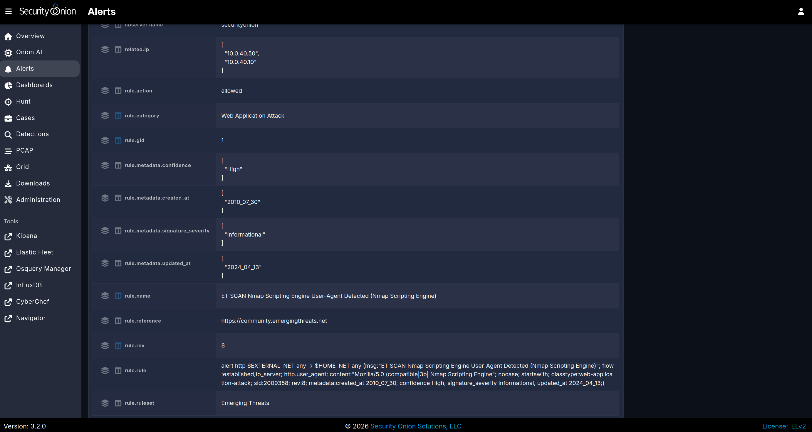

# 01 — Port Scan (T1046 Network Service Discovery)

**Attack in one sentence:** From Kali, an aggressive SYN scan enumerates open TCP ports/services on the domain controller.

## How I ran it

```bash
# from Kali (10.0.40.50) against DC01 (10.0.40.10)
nmap -sS -sV -p 1-10000 10.0.40.10
```

## What the network saw

**Zeek `conn.log` — the fan-out.** One source (`10.0.40.50`) opening tiny connections to many destination ports on `10.0.40.10`, most in `REJ` (rejected) state — the classic port-scan signature. Read live from the spool path:

```bash
sudo cat /nsm/zeek/spool/logger/conn.log | jq 'select(.["id.orig_h"]=="10.0.40.50")'
```



**Suricata — signature detection.** The scan lit up the ET SCAN ruleset: Nmap Scripting Engine user-agent, MS Terminal Server on non-standard port, and suspicious inbound to MSSQL/Oracle/PostgreSQL/MySQL/VNC — 30 alerts across 12 groups, several high severity.




## Host comparison

In the AD Security Lab this same scan barely registered in Windows event logs — a port scan is network behavior, not an authentication or process event, so host telemetry is nearly blind to it. This is the documented gap the network sensor closes.

## Triage & remediation

- **Triage:** one internal source hitting many ports on a DC in a tight window is reconnaissance; identify the source host and whether it should be scanning at all.
- **Remediation:** host-based firewalls to limit exposed services, network segmentation so a single client can't reach every port on the DC, and alerting on scan-rate behavior (see the custom rule in [04-custom-suricata-rules.md](04-custom-suricata-rules.md)).
