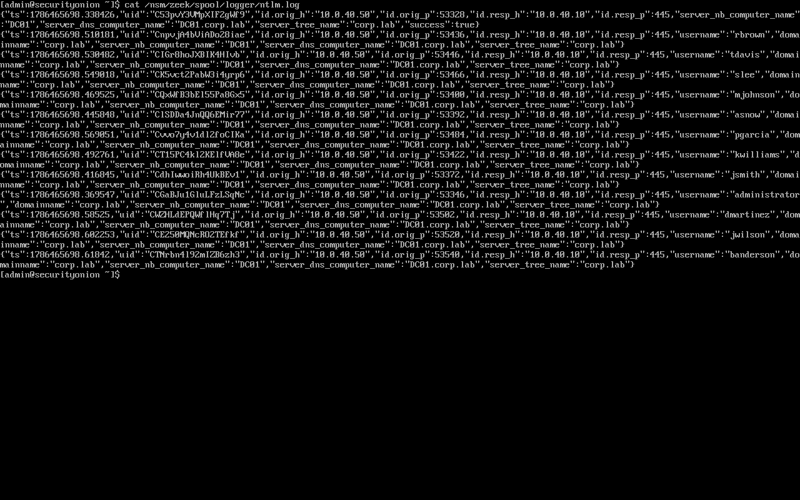
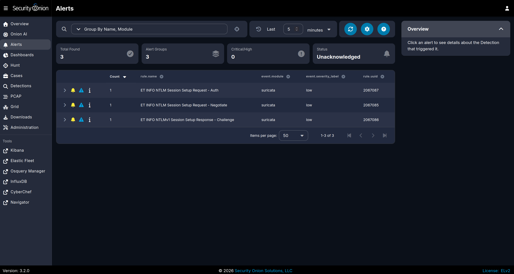
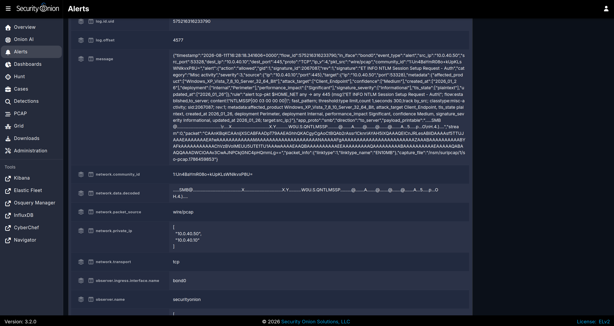

# 02 — Password Spray (T1110.003 Password Spraying)

**Attack in one sentence:** From Kali, a single password is tried against many domain usernames over SMB/NTLM to find one that sticks without locking accounts.

## How I ran it

```bash
# from Kali (10.0.40.50) against DC01 (10.0.40.10)
nxc smb 10.0.40.10 -u users.txt -p 'Spring2026!'
```

## What the network saw

**Zeek `ntlm.log` — the pattern.** SMB authentication in a Windows domain runs over NTLM, and `ntlm.log` carries the username, hostname, and success/failure. The spray shows as one source (`10.0.40.50`) sweeping many usernames (rbrown, tdavis, slee, mjohnson, asnow, pgarcia, kwilliams, jsmith, administrator, dmartinez, jwilson, banderson) against `10.0.40.10` in a tight window.

```bash
sudo cat /nsm/zeek/spool/logger/ntlm.log | jq '{ "src": .["id.orig_h"], username, success }'
```



> Note: I read this from `/nsm/zeek/spool/logger/ntlm.log` (the live spool), not `/nsm/zeek/logs/current/` — see [troubleshooting](../docs/troubleshooting-and-lessons.md#2--nsmzeeklogscurrent-rotates--the-live-logs-are-in-spoollogger) for why.

**Suricata — signature detection.** The NTLM session setup traffic fired ET INFO NTLM Session Setup Request (Auth / Negotiate) and NTLMv1 Session Setup Response (Challenge).




## Host comparison

This is the "both win" case. The **network** shows the *pattern* — one source, many usernames, tight window — which is the spray fingerprint. The **host** side (Windows 4625 failures and the 4624 success from the AD/Wazuh labs) names *which account actually fell*. Neither is complete alone: the network tells you a spray happened; the host tells you who it caught.

## Triage & remediation

- **Triage:** one source authenticating as many distinct users in a short window is a spray; check for any `success:true` to see if an account fell, and correlate to the host 4624 for attribution.
- **Remediation:** account lockout thresholds tuned against spraying, disable NTLM where possible in favour of Kerberos, MFA, and alert on many-usernames-one-source auth patterns.
