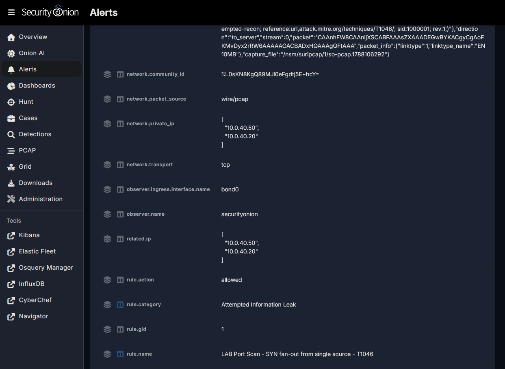

# 04 — Custom Suricata Rules

I authored a custom Suricata rule for network reconnaissance, covering a distinct ATT&CK technique — finding open services on a host (T1046).

Local rules use the `1000000+` SID range and are added through the SOC web UI (**Detections → + → Language: Suricata**), which deploys them to Suricata automatically.

## Rule 1000001 — SYN fan-out port scan (T1046) — WORKING

```
alert tcp any any -> $HOME_NET any (msg:"LAB Port Scan - SYN fan-out from single source - T1046"; flags:S; flow:stateless; detection_filter:track by_src, count 20, seconds 10; classtype:attempted-recon; reference:url,attack.mitre.org/techniques/T1046/; sid:1000001; rev:1;)
```

**Field breakdown**

| Clause | Meaning |
|--------|---------|
| `alert tcp any any -> $HOME_NET any` | Any TCP packet, from anywhere, into my network, to any port (a scan hits many ports — that's the behavior) |
| `flags:S` | Match packets with only the SYN flag — the first packet of a connection attempt, which a SYN scan fires in bulk without completing |
| `flow:stateless` | Evaluate each packet on its own, not only within an established session — a scan is half-open attempts that never become sessions |
| `detection_filter: track by_src, count 20, seconds 10` | Stay silent until one source sends 20 matching SYNs in 10 seconds, then alert — this is what turns "a SYN" (normal) into "a scan" |
| `classtype:attempted-recon` | Categorizes the alert as reconnaissance |
| `reference / sid / rev` | ATT&CK link, unique local SID, revision |

**One-line summary:** a stateless rule matching bare TCP SYNs into `$HOME_NET`, suppressed by a `detection_filter` until one source sends 20 SYNs in 10s — converting normal connection-initiation into a port-scan signal.

**Positive test — fired.** `nmap -sS -p 1-10000 10.0.40.10` from Kali. The alert shows my rule by name, `sid:1000001`, `10.0.40.50 → 10.0.40.20`, caught on `wire/pcap` via `bond0`.



**Negative test — verified,** a single benign connection to the same host did not fire the rule; the `detection_filter` threshold suppresses isolated events and only alerts on scan-rate activity. Testing both directions is what proves specificity rather than assuming it.

**Value:** Security Onion's ET ruleset already detects nmap, so this rule isn't filling a coverage gap — its value is that it's an authored rule that is tuned to a detection with a threshold and validated, showing detection engineering.
